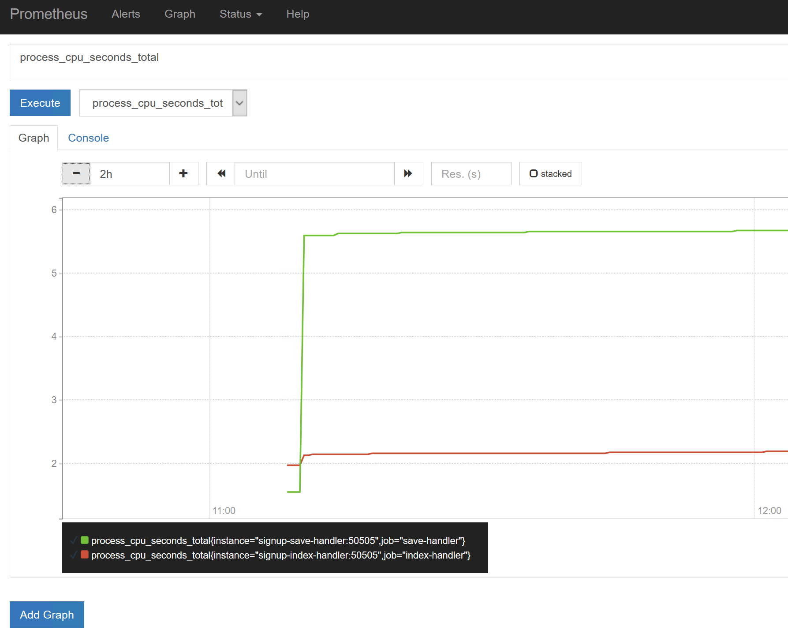

# Part 4 - Preparing for Production with Instrumentation

The app is ready to be promoted to production now, but we'll have problems when we run at scale. For production load you may run dozens of web containers and message handler containers, and currently the only instrumentation we have is text-based log entries. 

In Docker all containers look the same, whether they're running ASP.NET WebForms apps in Windows or .NET Core console apps in Linux - and you can expose metrics from containers to give you a single dashboard for the performance of all your containers.

In this section we'll add metrics to the solution using [Prometheus](http://prometheus.io) - a popular open-source monitoring server, and [Grafana](https://grafana.com) - a dashboard that plugs into Prometheus. We'll run those new components in Docker Windows containers too.

## Steps

* [1. Expose custom metrics from the message handlers](#1)
* [2. Expose IIS metrics from the web application](#2)
* [3. Run the solution with Prometheus and Grafana](#3)
* [4. Import the dashboard for the solution](#4)

## <a name="1"></a>Step 1. Expose custom metrics from the message handlers

You can instrumentation to your apps in two ways. The first is to record custom metrics in your code, which gives you clear insight into the specific events that interest you. 

The message handlers already have code to record metrics when they handle messages. In this step we'll expose those metrics on an HTTP endpoint, so Prometheus can scrape them.

You'll need to change the `Program.cs` files to uncomment the lines which start the metrics server:

- Open `.\signup\src\SignUp.MessageHandlers.IndexProspect\Program.cs`. Uncomment lines **23-25**.
- Open `.\signup\src\SignUp.MessageHandlers.SaveProspect\Program.cs`. Uncomment lines **25-27**.

In both cases, the `Main` method should now start like this:

```
var server = new MetricServer(50505, new IOnDemandCollector[] { new DotNetStatsCollector() });
server.Start();
Console.WriteLine($"Metrics server listening on port 50505");
```

The Dockerfiles for the handlers haven't changed, so you can rebuild them using the setup from Part 3, giving them a version 2 tag:

```
cd $env:workshop

docker image build --tag $env:dockerId/signup-index-handler:2 -f part-3\index-handler\Dockerfile .

docker image build --tag $env:dockerId/signup-save-handler:2 -f part-3\save-handler\Dockerfile .
```

When the handler containers run, they will have a Prometheus-compatible endpoint listening on port `50505`, which provides key .NET metrics as well as custom app metrics.


## <a name="2"></a>Step 2. Expose IIS metrics from the web application

The other way to add metrics to your app is to export Windows Performance Counters from the container. This way gives you core information without having to change your app code, but the metrics you get are only generic. 

In this step you'll expose IIS performance counters from the web app container.

In the [Dockerfile](part-4/web-1.4/Dockerfile) for version 1.4 of the app, there are additional steps to packe a console app alongside the web application. The console app exports the performance counter values from IIS as Prometheus-formatted metrics.

Build a new version of the web image which includes the metrics exporter:

```
cd $env:workshop

docker image build --tag $env:dockerId/signup-web:1.4 -f part-4\web-1.4\Dockerfile .
```

When the app container runs, it will also have a Prometheus-compatible endpoint listening on port `50505`, which provides performance counter metrics from the IIS Windows service hosting the app.


## <a name="3"></a>Step 3. Run the solution with Prometheus and Grafana

Prometheus is a metrics server. It runs a time-series database to store instrumentation data, polls configured endpoints to collect data, and provides an API (and a simple Web UI) to retrieve the raw or aggregated data.

Prometheus uses a simple configuration file, listing the endpoints it should scrape for metrics. We'll use an existing Prometheus Docker image as the base, and bundle a custom config file for our app, in [prometheus.yml](part-4/prometheus/prometheus.yml):

```
cd "$env:workshop\part-4\prometheus"

docker image build --tag $env:dockerId/signup-prometheus .
```

Grafana is a dashboard server. It can connect to various data sources and provide rich dashboards to show the overall health of your app. There isn't an official Windows variant of the Grafana image, but it's easy to build your own. The [Dockerfile for Grafana]() is a good example of how to package third-party apps to run in containers.

Build the Grafana image so we can run a dashboard showing the health of the app:

```
cd "$env:workshop\part-4\grafana"

docker image build --tag $env:dockerId/signup-grafana .
```

Now we can deploy the updated application. Use Docker Compose to update the containers to [version 1.6](app/docker-compose-1.6.yml) of the solution:

```
cd "$env:workshop\app"

docker-compose -f .\docker-compose-1.6.yml up -d
```

## <a name="4"></a>Step 4. Import the dashboard for the solution


Browse to the new application container, and send some load - refresh the homepage a few times, and then submit a form:

```
$ip = docker container inspect --format '{{ .NetworkSettings.Networks.nat.IPAddress }}' app_signup-web_1
firefox "http://$ip"
```

You can see the metrics data collected in the basic Prometheus UI:

```
$ip = docker container inspect --format '{{ .NetworkSettings.Networks.nat.IPAddress }}' app_prometheus_1
firefox "http://$($ip):9090"
```



The Prometheus UI is good for sanity-checking the metrics collection. 

Prometheus itself records metrics, so you can look at the `scrape_samples_scraped` metric to see how many times Prometheus has polled the container endpoints.

But the Prometheus UI isn't featured enough for a dashboard - for that we'll set up Grafana. First browse to the Grafana container:

```
$ip = docker container inspect --format '{{ .NetworkSettings.Networks.nat.IPAddress }}' app_grafana_1
firefox "http://$($ip):3000"
```

- Login with credentials `admin` / `admin`

- Select _Add data source_ and configure a new Prometheus data source as follows:


- Name: `Sign Up`
- Type: `Prometheus`
- Url: `http://prometheus:9090`
- Access: `proxy`

Now from the main menu select _Dashboards...Import_, load the [SignUp-dashboard.json](part-4/grafana/SignUp-dashboard.json) file and connect it to the Prometheus data source:


You'll see an overall dashboard showing the status and performance of the web application and the message handlers:


The dashboard shows how many HTTP requests are coming in to the web app, and how many events the handlers have received, processed and failed.

It also shows memory and CPU usage for the apps inside the containers, so at a glance you can see how hard your containers are working and what they're doing.

## Next Up

For a half-day workshop, we're done! You've seen how to run Windows apps in Docker containers, add third-party components to your solution, break features out of monoliths, and add consistent instrumentation. 

You've done what you need to move your own apps to Docker in production. Next steps:

- try one of the [Docker labs on GitHub](https://github.com/docker/labs)
- follow [@EltonStoneman on Twitter](https://twitter.com/EltonStoneman)
- buy a ticket for [DockerCon](https://europe-2017.dockercon.com)
- read [Docker on Windows](https://www.amazon.co.uk/Docker-Windows-Elton-Stoneman/dp/1785281658), the book

For a whole-day workshop, we'll continue after lunch. In [Part 5](part-5.md) you'll learn how to add resilience and scalability to your apps with Docker Compose.