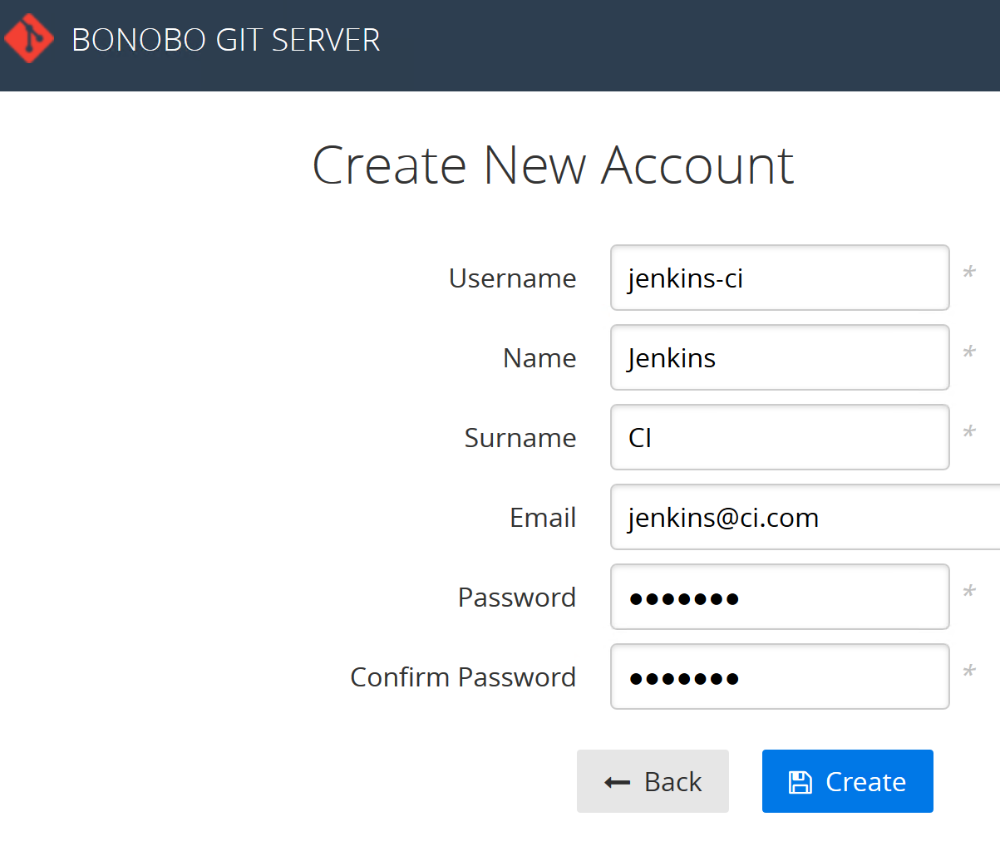
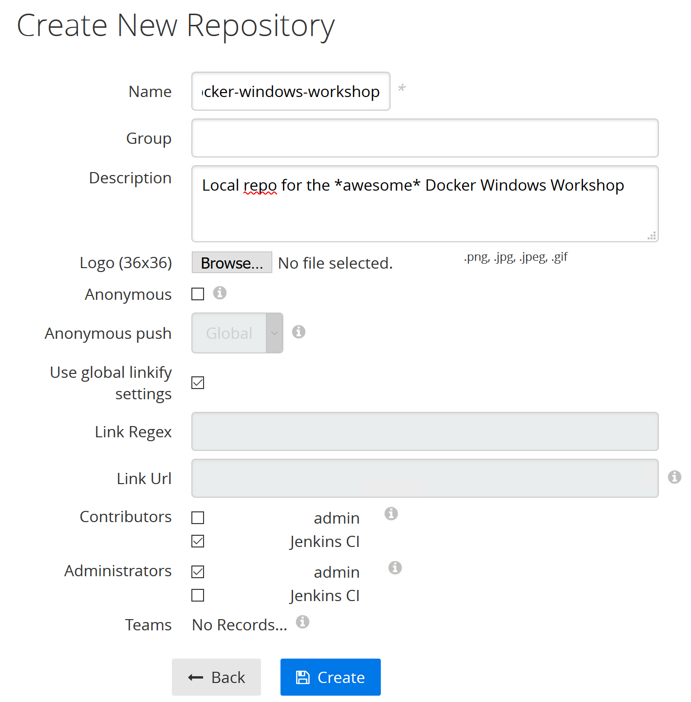
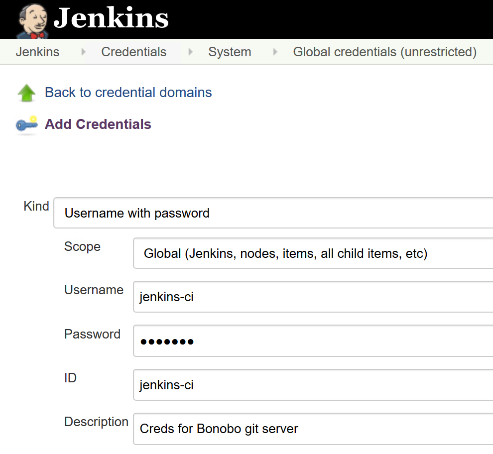
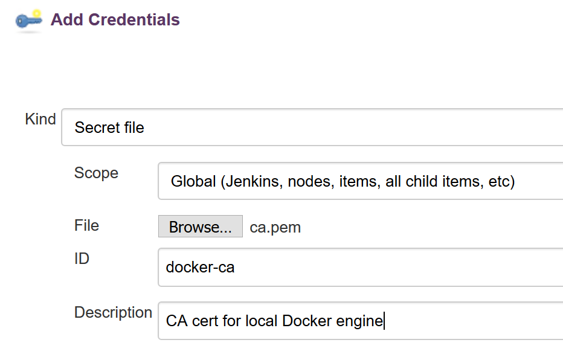
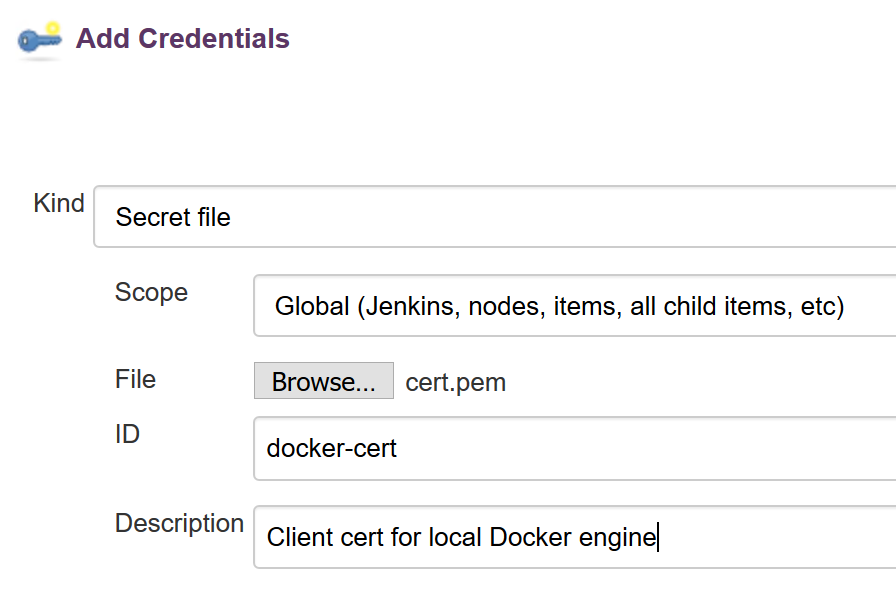
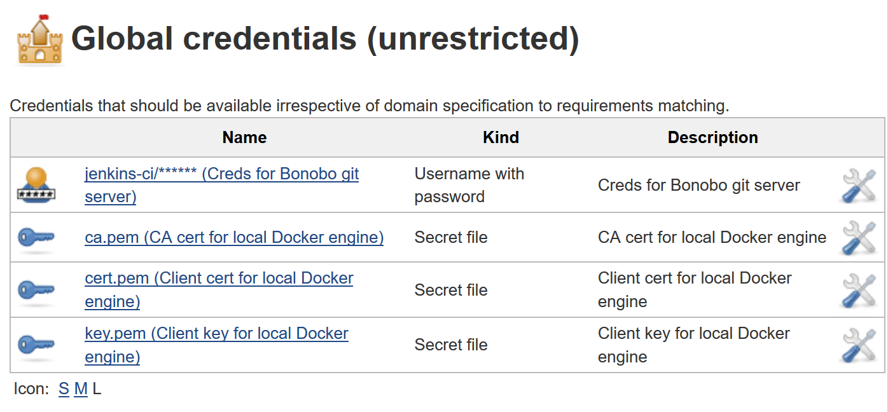
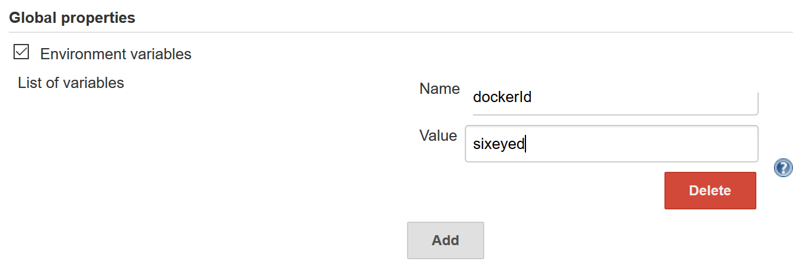
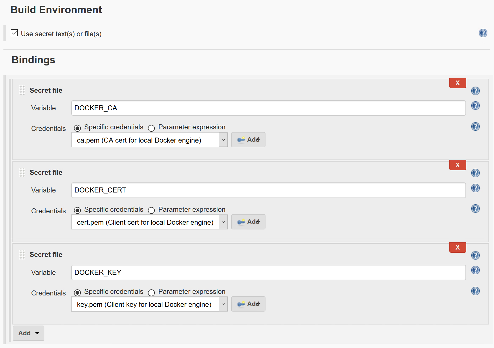
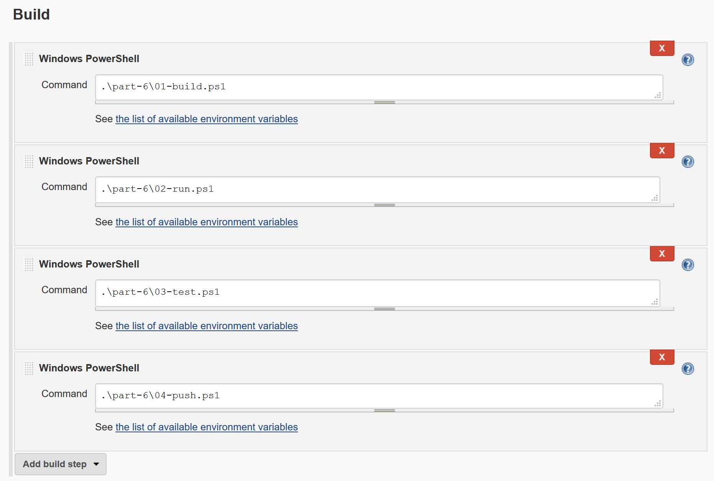

# Part 6 - Containerized CI (and CD) with Docker

It's very simple to configure a full CI system using Docker - where the source control, automation server and build agents all run in containers. The multi-stage Dockerfiles for the SignUp app mean you only need Docker installed to compile, package, run and test the app. 

## Steps

* [1. Configure Docker for remote access](#1)
* [2. Prepare Jenkins](#2)
* [3. Run infrastructure services](#3)
* [4. Configure and run the CI job](#4)


## <a name="1"></a>Step 1. Configure Docker for remote access

Docker comes in two parts - the `docker` command line talks to the Docker engine, using a REST API. In Windows the engine runs as a Windows Service. You can configure the engine to accept remote connections, so a user on a different machine can run `docker` commands against your server.

We'll set up the Docker engine to allow remote access, but only through a secure channel. First we need two IP addresses:

```
ipconfig
```

On Azure, the server's internal IP address will start with `10.0.0`. There will also be a virtual IP address used as a gateway by Docker containers - it's named _vEthernet (HNS Internal NIC)_ and starts `172`. Save those IP address as variables:

```
$ipAddress='<ip address - 10.0.0.x>'
$gatewayAddress='<gateway address - 172.x.x.x'
```

Now we'll run a task container whichs creates SSL certificates, and modifies the Docker engine configuration to allow remote connections with SSL only:

```
mkdir -p C:\certs\vm\client

docker container run --rm `
 -e SERVER_NAME=$(hostname) `
 -e IP_ADDRESSES=127.0.0.1,$ipAddress,$gatewayAddress `
 -v 'C:\ProgramData\docker:C:\ProgramData\docker' `
 -v 'C:\certs\vm\client:C:\Users\ContainerAdministrator\.docker' `
 stefanscherer/dockertls-windows
```

> This uses the image from [Docker Captain](https://www.docker.com/community/docker-captains) [Stefan Scherer](https://twitter.com/stefscherer), described in [How to protect a Windows 2016 Docker engine with TLS](https://stefanscherer.github.io/protecting-a-windows-2016-docker-engine-with-tls/)

To pick up the new configuration, restart the Docker Windows Service:

```
Restart-Service docker
```

When the Docker service restarts, it will restart all the application containers because they were created with the `restart` option.

On the local VM you use the `docker` commands in the same way, but on a remote machine (or through another container), you can now connect to the Docker engine securely with mutual TLS.


## <a name="2"></a>Step 2. Prepare Jenkins

We'll use the [Jenkins](https://jenkins.io/index.html) automation server to run the CI job to build the Docker solution. Jenkins has a basic install process, and then adds functionality with plug-ins.

> Jenkins is a good example of an app which is hard to full configure in a Dockerfile. There are tools which let you script plug-ins, but they don't always deploy dependencies. Instead we'll build a base image, complete the installation manually and then commit an image from the container.

Start by building a basic Jenkins Docker image, which contains Git and Docker clients, from this [Dockerfile](part-6/jenkins/Dockerfile). That image will be used to prepare the full Jenkins setup:

```
cd $env:workshop\part-6\jenkins

docker image build --tag $env:dockerId/jenkins:prep .
```

Run Jenkins in a container, mapping the data folder in a volume - so all the Jenkins data is stored on the host:

```
mkdir C:\jenkins

docker container run -d -P -v C:\jenkins:C:\data --name jenkins $env:dockerId/jenkins:prep
```

Now get the IP address and browse to it (Jenkins uses port `8080` by default):

```
$ip = docker container inspect --format '{{ .NetworkSettings.Networks.nat.IPAddress }}' jenkins

firefox "http://$($ip):8080"
```

For each new install, Jenkins generates a random administrator password. You can see the password in the container logs:

```
docker container logs jenkins
```

Back in the Jenkins UI, configure the plugins we'll use. Don't choose the default set, instead click *Select Plugins to Install*. Then:

- Choose *None*
- Add `Git plugin` and `Credentials Binding Plugin`

> Note there's no build agent here. We don't need the MSBuild plugin because the compilation is all done in Docker.

You should see just these plugins installing:


In a real environment you would set up an admin user now, rather than use the built-in admin user. But for the workshop just select *Continue as admin*:


Once the basic install completes, select *Manage Jenkins* then *Manage Plugins* to add one more plugin:


- Manage jenkins/manage plugins
- Choose *Available*
- Filter on *PowerShell*
- Select *Install without restart*

That gives us a fully configured Jenkins instance. We can export the container as an image which is our portable CI server.  We need to stop the container first, then `commit` the container as an image, and then we can remove the container:

```
docker container stop jenkins

docker container commit jenkins $env:dockerId/jenkins:configured

docker container rm jenkins
```

Now we have a configured Jenkins server in a Docker image, so wherever we run a container we will have the same Jenkins setup, with all the plugins and dependencies we need ready configured.

## <a name="3"></a>Step 3. Run infrastructure services

For our full CI setup, we'll use a Git server and a local Docker registry, as well as Jenkins. We'll run them all in containers. Having your complete build environment in containers is useful - it means your whole application deployment pipeline becomes portable.

## Start the Infrastructure Services

The [infrastructure Docker Compose file](part-6/infrastructure/docker-compose.yml) sets up all the CI services, using host mounts for the data volumes.

Start all the containers with compose:

```
mkdir C:\registry

mkdir C:\bonobo

cd $env:workshop\part-6\infrastructure

docker-compose up -d
```

The containers use random IP addresses, but it would be better to refer to them using hostnames. Run this script to add hostname aliases for the container IP addresses:

```
cd "$env:workshop\part-6"

.\write-hosts.ps1
```

This just fetches the container IP addresses and adds them to the Windows `hosts` file, with `.local` domain names. You'll see entries similar to these at the end of `C:\Windows\System32\drivers\etc\hosts`:

```
172.19.240.200 registry.local
172.19.240.201 bonobo.local
172.19.240.202 jenkins.local
```

Your IP addresses will be different, because Docker uses a random IP address range on Windows, as well as random IP addresses for each container.

> An alternative is to start containers with explicit IP addresses. On Windows you need to configure the Docker NAT network to specify the IP address range you want to use. This blog on [configuring NAT](https://4sysops.com/archives/windows-container-networking-part-1-configuring-nat/) shows you how to do that.

## Setup the Bonobo Git Server

[Bonobo](https://bonobogitserver.com) is an open-source ASP.NET Git server. You're running Bonobo from my image - [sixeyed/bonobo](https://github.com/sixeyed/dockerfiles-windows/tree/master/bonobo). Browse to the Bonobo app running in the container:

```
firefox http://bonobo.local/bonobo.git.server
```

Log in with the credentials `admin/admin`, and click *Users* / *Create new user* to add a user. This will be used by the Jenkins service, so the username will be `jenkins-ci`, and the password `jenkins`:



Then create a new repository for the source code. Click *Repositories* / *Create new repository*.  Call it `docker-windows-workshop`, and add the `jenkins-ci` user as a contributor:



Now push the local source code on your machine to the Git server running in Docker:

```
cd $env:workshop

git remote add bonobo.local http://bonobo.local/Bonobo.Git.Server/docker-windows-workshop.git

git push bonobo.local master
```

You'll need to log in to Bonobo when you push - you can use the default `admin/admin` credentials:


This pushes the repository from your local disk to the Git server running in the container. The storage for Bonobo is configured to use a local volume, so the actual data gets stored in the `C` drive on your host.

Explore `C:\bonobo` and you'll see the Bonobo database and the repo folders are there:

```
& tree C:\bonobo
```

Now the code is available in our private Git repo, we can configure Jenkins to build the project.

## Set up credentials for Jenkins 

Browse to Jenkins on http://jenkins.local:8080.

> If you can't remember your Jenkins admin password, you can find it with this command: `cat /jenkins/jenkins/secrets/initialAdminPassword`. Remember the Jenkins files are stored on your host, using the volume mount.

We need to start by setting up credentials, so Jenkins can use the Git server and connect to Docker. Go to _Credentials/Global_ and click *Add Credentials*. You need to set up four new credentials:

1. a `Username with password` credential for Bonobo, username `jenkins-ci`, password `jenkins`



2. a `Secret file` credential for the generated CA certificate - upload `C:\certs\vm\client\ca.pem` and call it `docker-ca`



3. a `Secret file` credential for the generated certificate - upload `C:\certs\vm\client\cert.pem` and call it `docker-cert`



4. a `Secret file` credential for the generated key - upload `C:\certs\vm\client\key.pem` and call it `docker-key`


You should have four global credentials saved, which means Jenkins jobs can fetch from Git repositories and securely invoke commands on the local Docker engine:



## Set up your Docker ID 

Now store your Docker ID in a global variable, so it's available as an environment variable to all the job steps. Under _Manage Jenkins/Configure System_, select _Environment variables_ and add a variable with the name `dockerId` and a value with your Docker ID:




## <a name="2"></a>Step 4. 4. Configure and run the CI job

Setting up the infrastructure services is the hard part. Now we'll configure a CI job for Jenkins to build, run and test the full solution. This is much easier - we'll be using simple PowerShell scripts which run Docker commands. All the work is done in Docker containers.

## Configure the Jenkins CI job

Back in the Jenkins homepage, click _New item_ to add a job. Call it `signup` and select the _Freestyle_ job type.

In the _Source Code Management_ tab select `Git` and configure the connection to the Git server: 

- _Repository URL_ - `http://bonobo/Bonobo.Git.Server/docker-windows-workshop.git`
- _Credentials_ - `jenkins-ci`


When you run the job, Jenkins will pull the latest code from the Git server - which is the contents of this repo. It has all the solution source code, build scripts, Dockerfiles and Docker Compose files which will get used in the build. 

> Remember that Jenkins is running inside a container. It can reach the Git server by its container name - so the domain name in the URL is just `bonobo`.

In the _Build_ tab, select _Use secret text(s) or file(s), and add three _Secret file_ bindings:

- `DOCKER_CA` using the `ca.pem` credential
- `DOCKER_CERT` using the `cert.pem` credential
- `DOCKER_KEY` using the `key.pem` credential



This is how Jenkins makes the certificate secrets available to the job. When the job runs, the secrets are surfaced as files, with the file path in an environment variable named after the binding (e.g. the Docker client certificate will be in a file, and the file path will be `$env:DOCKER_CERT`).

The PowerShell build scripts use those certificate paths to connect to the Docker engine running on the host.

Still in the _Build_ tab, click to add four build steps - all using _Windows PowerShell_ commands. The PowerShell scripts all use Docker Compose:

- `.\part-6\01-build.ps1`
- `.\part-6\02-run.ps1` 
- `.\part-6\03-test.ps1` 
- `.\part-6\04-push.ps1` 



That's it! Click _Save_ and then click _Build Now_ to start the job. You can click on the job number in the lict and select _Console Output_ to view the progress of the job.

This is what the CI job does:

- builds all the Docker images (script [01-build.ps1](part-6/01-build.ps1)) using multiple Compose scripts, which specify the paths to all the image contexts and Dockerfiles

- runs the solution in containers (script [02-run.ps1](part-6/02-run.ps1)) using Docker Compose

- executes an end-to-end test suite in a container (script [03-test.ps1](part-6/03-test.ps1)) - this uses a headless web browser to simulate users connecting to the website

- pushes the build images to the local registry (script [04-push.ps1](part-6/04-push.ps1))

> Your local registry is running on HTTP, not HTTPS. Docker doesn't allow pushes to insecure registries by default, but part of the setup script for the lab VM creates the [daemon.json](lab-vm/docker/daemon.json) config file to allow insecure push to `registry.local`.

You'll see all the usual Docker commands running, as the CI job builds all the images. The Jenkins job is running commands on your local Docker host, so you will see some image layers come from the cache, where Docker has been able to re-use parts of the build.

At the end of the build, you will have a versioned set of application images in your local Docker registry - you can see the repository list from this API call:

```
(iwr http://registry.local:5000/v2_catalog).Content | ConvertFrom-Json
```


## Next Up

We have an automated CI pipeline now, which can build and push a versioned set of images with every push to the source repository.In [Part 7](part-7.md) we'll switch to swarm mode and run the application in a highly-available cluster.
